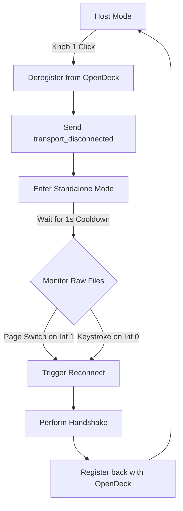

# K1 Pro Standalone Mode Implementation

This document describes the design, implementation details, and hardware constraints resolved to support switching the StreamDock K1 Pro between OpenDeck (host-controlled) mode and the device's internal flash (standalone) profiles.

---

## 1. Hardware Interface Architecture

The StreamDock K1 Pro exposes two primary USB HID interfaces to the operating system:

| Interface | Default Linux Path (Example) | Purpose |
| :--- | :--- | :--- |
| **Interface 0** | `/dev/hidraw4` | Standard boot-protocol keyboard, system controls, and consumer/media control reports. |
| **Interface 1** | `/dev/hidraw5` | Custom vendor communication channel used for host control (handshake, screen streaming, button images, brightness, OS mode switches). |

### Host-Controlled Mode (OpenDeck)
* Communication occurs entirely on **Interface 1** using report ID `0x04` and report size `513`.
* The plugin receives raw events (button clicks, knob presses, and encoder rotations) and translates them into OpenDeck JSON messages via WebSockets.

### Standalone Mode (Internal Flash Profiles)
* The host-control mode is deactivated by calling the SDK FFI function `transport_disconnected`.
* The device resumes displaying and executing profiles stored in its onboard flash memory.
* Interactive actions (button presses and knob clicks) generate standard HID keycode reports on **Interface 0**.

---

## 2. Limitations of the SDK FFI

During implementation, we identified a critical limitation in the vendor SDK's `transport_read` FFI function:
* The SDK's read function is configured specifically for vendor host-controlled packets (expecting report ID `0x04`).
* When the device is in standalone mode, standard boot-protocol reports (such as a standard key press event) sent on **Interface 0** do not match the expected report ID or size.
* Consequently, calling `transport_read` on Interface 0 always returns a read timeout error (`0x05000302`), failing to register any user activity.

---

## 3. Design and Non-Blocking Implementation

To bypass FFI limitations and prevent system hangs, we implemented direct raw I/O reading with thread-safe transition cooldowns.

### A. Non-Blocking Raw Reading to Prevent Thread-Pool Exhaustion
Because Linux character devices (like `/dev/hidraw`) do not support epoll-based asynchronous notifications, invoking standard blocking reads inside a Tokio task spawns blocking OS threads (`spawn_blocking`). When multiple timeouts occur, the pool exhausts quickly, hanging the plugin.

We resolved this by:
1. Opening `/dev/hidraw` devices directly as synchronous files with the `libc::O_NONBLOCK` flag.
2. Checking for data using standard `Read::read`.
3. If no data is available, handling `ErrorKind::WouldBlock` by sleeping asynchronously for `100ms` (for Interface 1) or `5ms` (for Interface 0), yielding execution back to Tokio.

### B. Capture of USB Paths in Watcher
The watcher task (`watcher.rs`) was updated to capture both interface paths:
* `path_int1` is extracted from the primary usage-page 65440 match.
* `path_int0` is captured by scanning for the matching serial number on `interface_number == 0`.

### C. Double-Transition Cooldowns
To prevent infinite toggle loops (e.g., when the user releases Knob 1 after switching, generating a trailing key release event), we added two mutex-protected timestamp fields to the `Device` struct:
* `last_host_transition`: Cooldown window (1 second) to ignore Knob 1 click events immediately after entering host mode.
* `last_standalone_transition`: Cooldown window (1 second) to ignore Interface 0 keyboard activity immediately after entering standalone mode.

### D. Page-Based Turn-vs-Click State Machine
In standalone mode, K1 Pro profiles use different page screens for button keycodes and encoder rotations:
* **Page 0 (`scr: 0`)**: The default active page containing click operations.
* **Page 1 (`scr: 1`)**: The page transitioned to during knob rotation.

To ensure that knob turns do not trigger reconnection back to host-controlled mode:
1. The plugin tracks the current active screen via `standalone_current_scr` (initialized to `Some(0)` upon entering standalone mode).
2. The Interface 1 reader monitors page updates. If the page transitions from `1` to `0` (a knob click/release action that returns to the main page), it triggers reconnection. Transitions to `1` (rotations) are ignored.
3. The Interface 0 keyboard report reader checks the current `scr` state. If `standalone_current_scr` is `Some(1)` (rotation page), the keyboard activity is ignored. Reconnection is only triggered if the activity occurs while on `scr: 0` (click page).

### E. Re-registration Protocol
When a reconnection condition is met:
1. The raw file handles are closed to release the hidraw devices.
2. The standard connection handshake is run on the primary FFI handle.
3. The plugin sends a `deregister_device` and subsequent `register_device` event via the WebSocket client to the OpenDeck core, forcing a refresh/redrawing of all screen layouts.
